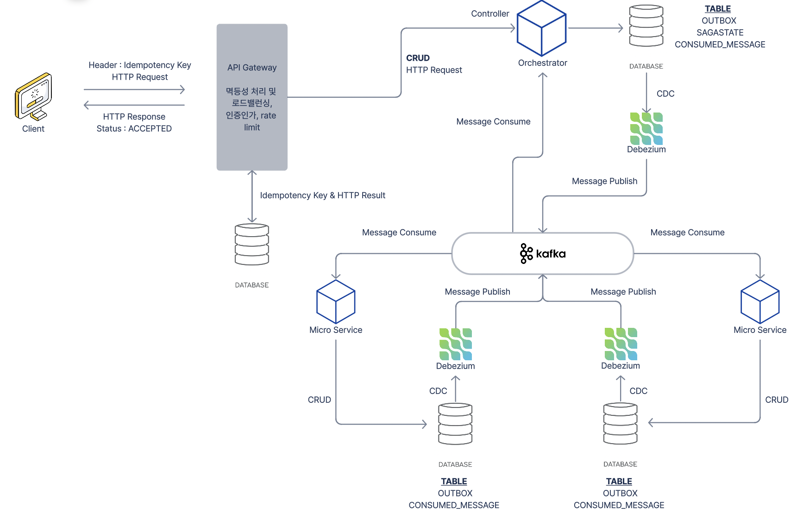
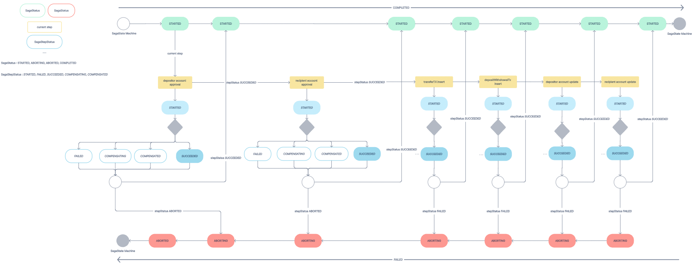

# MSA PoC
해당 PoC는 [Saga패턴](https://microservices.io/patterns/data/saga.html)을 기반으로 마이크로서비스의 분산 트랜잭션을 구현하였습니다. 

또한, Transactional Outbox Pattern을 기반으로 구현되어 데이터베이스와 메시징 시스템 간의 일관성을 보장하였습니다. Debezium을 기반으로 데이터의 변경사항을 캡쳐(CDC)하여 데이터 손실이나 중복 메시지 전송 없이 신뢰할 수 있는 통신을 가능하게 하였습니다.

## Architecture

## Saga State Machine
### 이체

# Reference
[[Confluence] MSA 아키텍처 PoC](https://tmaxfintechofficial.atlassian.net/wiki/spaces/FT/pages/272728258/CoreBank+MSA+PoC)

https://github.com/debezium/debezium-examples