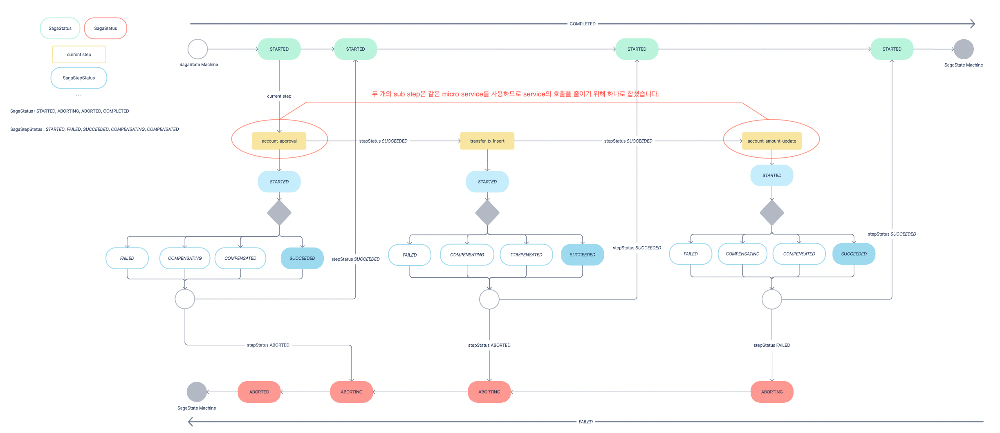

# CoreBank-MSA-PoC
MSA의 분산 트랜잭션의 원자성을 유지하기 위해 [Saga패턴](https://microservices.io/patterns/data/saga.html)을 사용했습니다.
또한, Transactional Outbox 패턴을 사용하여 데이터베이스와 메시지 발행 간의 원자성을 보장하였습니다. Transactional Outbox 패턴은 Debezium을 기반으로 데이터의 변경사항을 캡쳐(CDC)하여 데이터 손실이나 중복 메시지 전송 없이 신뢰할 수 있는 통신을 가능하게 합니다.

## Architecture


## Saga Status
**SagaStatus**

- STARTED
- ABORTING
- ABORTED
- COMPLETED

**SagaStepStatus(하나의 트랜잭션에서 실행할 Sub Step Status)**

- STARTED
- FAILED
- SUCCEEDED
- COMPENSATING
- COMPENSATED

## 이체 API
이체 API를 기반으로 Saga 패턴과 Transactional Outbox 패턴의 로직을 설명하겠습니다.

### 이체 Saga State Machine


### 이체 API에서 사용되는 Micro Service
각 서비스에서는 다음과 같은 비즈니스 로직을 실행합니다.
1. Orchestrator : TransferSaga 인스턴스를 생성
2. AccountService : 계좌 상태 확인 후 잔액 Update
3. BankingService : 입금, 지급 트랜잭션 Insert

### Orchestrator 실행 로직 설명
1. Orchestrator의 [SagaManager](https://github.com/PMH2906/CoreBank-MSA-PoC/blob/0a3194f6b6285521de16b83bce70d289ddb293cc/orchestrator/src/main/java/com/tmax/orchestrator/framework/SagaManager.java#L23)의 begin 메서드를 통해 Transfer Saga를 생성하고, sagastate 테이블에 SagaState를 저장합니다. sagastate 테이블에는 아래 값이 저장됩니다.

    ```json
    {
      "id": "SAGA ID",
      "currentstep": "현재 실행되는 Sub Step 단계",
      "payload": "IPC 과정에서 필요한 데이터",
      "stepstatus": "{Saga에서 실행한 Sub Step들의 단계}",
      "type": "Saga의 종류(ex. 이체, 입금, 출금 등)",
      "version": 0
    }
    ```
2. [SagaBase](https://github.com/PMH2906/CoreBank-MSA-PoC/blob/0a3194f6b6285521de16b83bce70d289ddb293cc/orchestrator/src/main/java/com/tmax/orchestrator/framework/SagaBase.java#L148)의 advance 메서드를 통해 [TransferSaga](https://github.com/PMH2906/CoreBank-MSA-PoC/blob/0a3194f6b6285521de16b83bce70d289ddb293cc/orchestrator/src/main/java/com/tmax/orchestrator/saga/TransferSaga.java#L29)에 정의된 sub step을 실행합니다. sub step의 Micro Service를 호출하기 위해 Outbox Table에 메세지를 저장합니다.
3. outbox 테이블의 변경 사항을 감지한 Debezium 커넥터가 설정된 Kafka 토픽에 메시지를 publish합니다.
4. 해당 Kafka 토픽을 구독하고 있던 Micro Service가 메세지를 consume하여 비즈니스 로직을 실행합니다.
5. 각 Micro Service는 실행한 비즈니스 결과를 Outbox 테이블에 저장합니다.
6. outbox 테이블의 변경 사항을 감지한 Debezium 커넥터가 설정된 Kafka 토픽에 메시지를 publish합니다.
7. 해당 Kafka 토픽을 구독하고 있던 [Orchestrator](https://github.com/PMH2906/CoreBank-MSA-PoC/blob/0a3194f6b6285521de16b83bce70d289ddb293cc/orchestrator/src/main/java/com/tmax/orchestrator/kafka/OrchestratorConsumer.java)가 메세지를 consume합니다.
9. [SagaBase](https://github.com/PMH2906/CoreBank-MSA-PoC/blob/0a3194f6b6285521de16b83bce70d289ddb293cc/orchestrator/src/main/java/com/tmax/orchestrator/framework/SagaBase.java#L71)의 onStepEvent 메서드를 통해 Saga의 sub step의 상태를 업데이트하고, sub step의 상태에 따라 다음 sub step을 실행하거나 보상 트랜잭션을 실행합니다.

# Reference
https://github.com/debezium/debezium-examples